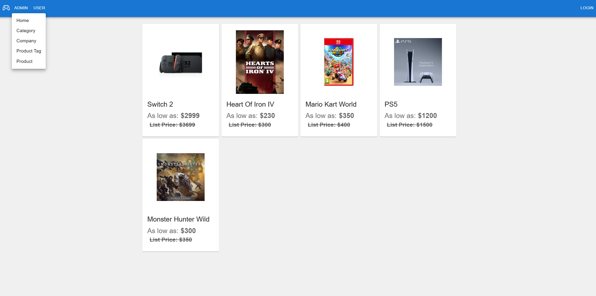
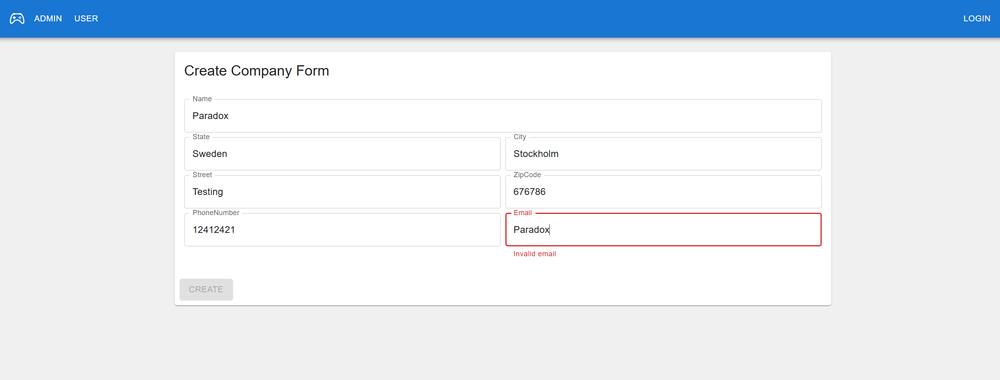
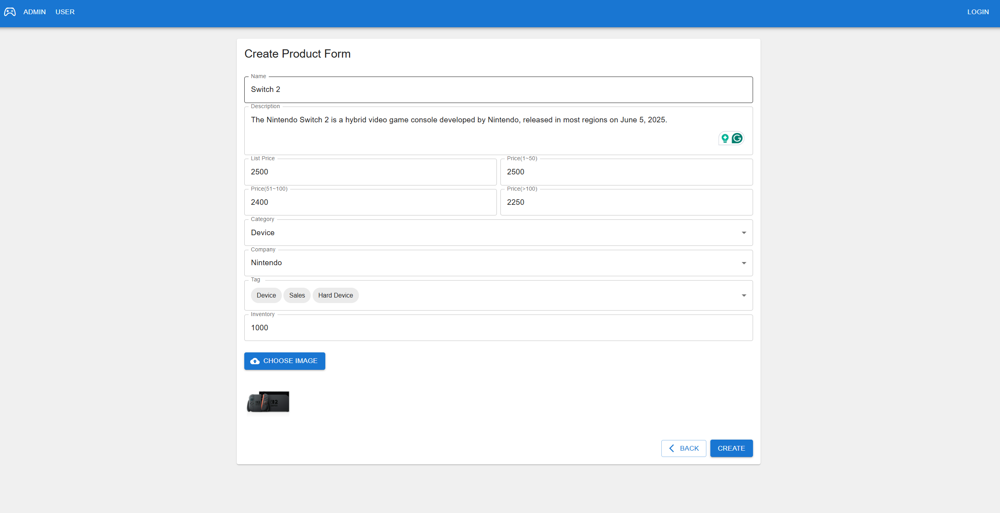
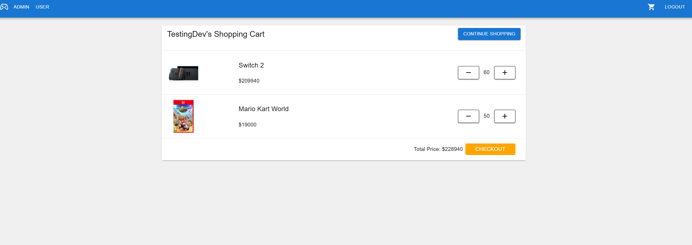
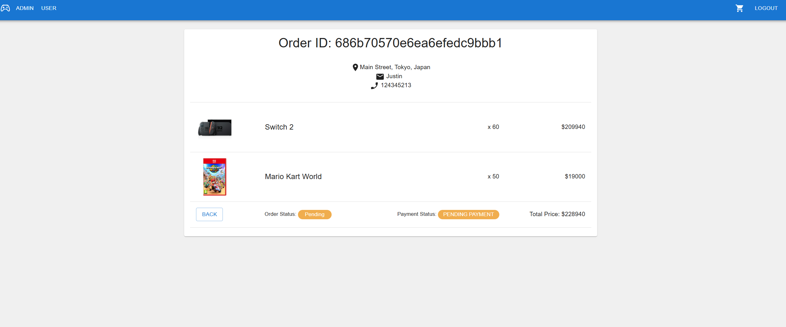
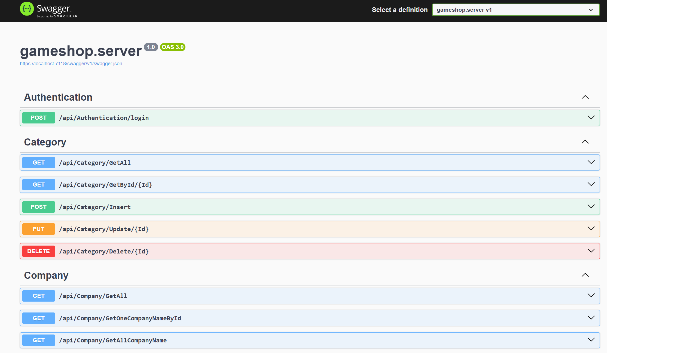

# Game Shop Web App Project (Finished)

This is an e-shop web application using .NET Core as the back-end, React(with TypeScript) as the front-end, and MongoDB as the database

## Feature
* Shopkeepers can manage their shops' product information, such as price, production company, and product tags on the website.
* Customers can add the product to their shopping cart and check out as an order
* Including the identity server for user authorization
* Deployment to cloud server

Including validation for each form 

Including goods management system, shopping cart and order detail page

## Tech Stack
### Frontend
Programming language: TypeScript
* ReactJS, including React-router-dom
* Use Axios to connect server web api (Rest Api)
* Less.css
* Material-ui
* Formik for form validation
  

### Backend
Programming language: C#
* .NET 8.0
* MongoDB with C# driver 
* MongoDB file storage(GridFs)
* MongoContext (EF Core of MongoDB)
* Repository Pattern
* Unit of work
* Using JWT as authorization
* Using MongoDB identity Server(including application user and role)

### Deployment
* Build Pipeline on Azure DevOps
* Build both client and server image
* (Todo) Deploy to Azure Web Container

### Todo
* Role and user manager backend apis are ready, but the frontend pages of these two features haven't been done yet